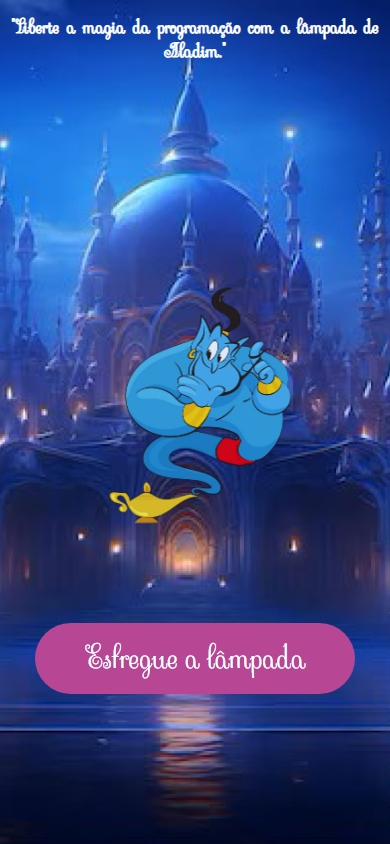

# Desafio React - Gênio do React

## Descrição
Este projeto é uma aplicação em React que utiliza **styled-components** e **SCSS** para criar uma interface interativa onde o usuário pode alternar entre duas imagens ao "esfregar" a lâmpada mágica. A aplicação exibe uma mensagem motivacional para "libertar a magia da programação".

## Tecnologias Utilizadas


## Estrutura do Projeto
O projeto está organizado da seguinte forma:
- **src/App.jsx:** Componente principal da aplicação.
- **src/assets:** Contém as imagens usadas na interface.
- **style.scss:** Estilos globais em SCSS.

## Demonstração
* **Versão DESKTOP:**
<div align="center">


</div><br><br>

* **Versão MOBILE:**
<p align="center" width="100%">
  &nbsp;&nbsp;&nbsp;&nbsp;&nbsp;&nbsp;&nbsp;&nbsp;&nbsp;
  
</p><br><br>

* **Você pode visualizar uma versão ao vivo do site através do seguinte link: [Demonstração Gênio React](https://desafio-genio-do-react.vercel.app)**

## Instalação e Execução
1. **Clone o repositório:**
   ```bash
   git clone https://github.com/edimaiquemaciel/desafio-react---genio-do-react.git
   ```
2. **Instale as dependências:**
   ```bash
   npm install
   ```
3. **Execute o projeto:**
   ```bash
   npm run dev
   ```
